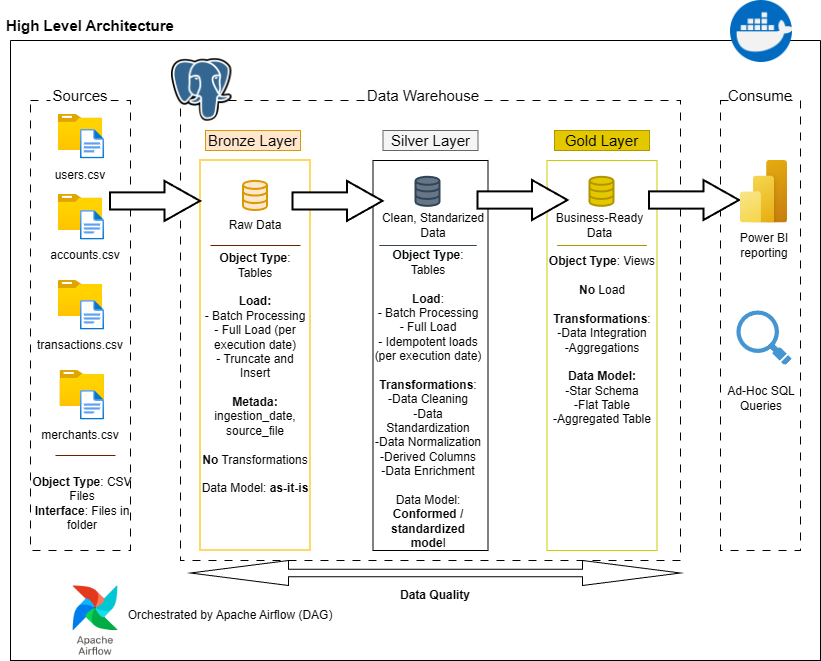

# FinTech Bronze–Silver–Gold Data Pipeline

This project implements a batch-oriented FinTech data pipeline using a Bronze–Silver–Gold architecture orchestrated with Apache Airflow and PostgreSQL.

## Architecture

## Tech Stack
- Apache Airflow
- PostgreSQL
- Docker & Docker Compose

## Status
Project initialization completed. Bronze layer development in progress.
